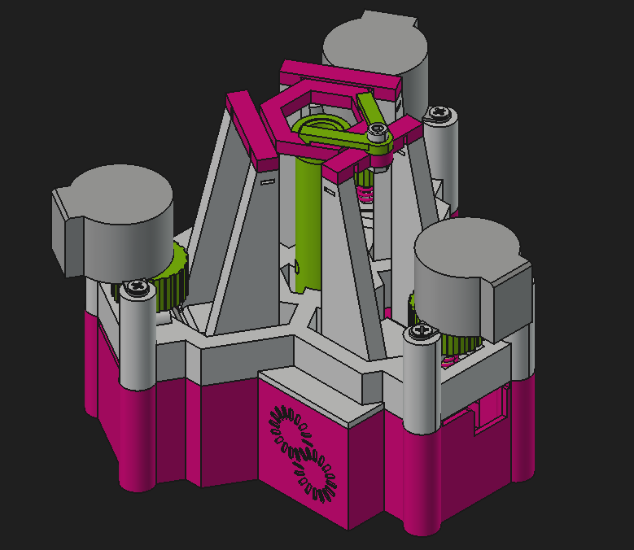
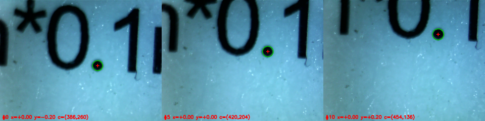
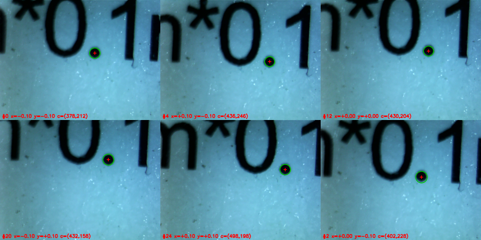

# DeltaBot controller



Python control for the 3d printed DeltaBot: an Arduino Nano + GRBL CNC shield
driving three 28BYJ-48 steppers, each turning an M3 x 20 hex bolt in a captive
nut so that it acts as a screw jack under one leg of the flexure stage.

The stage is **over-constrained**: three actuators drive two useful degrees of
freedom. Each screw's vertical travel is converted by its compliant leg into an
in-plane displacement of the top plate along that leg's direction, so the
machine is an XY stage. Z is not commanded - it follows as a second order
consequence of moving off centre, and is reported as an estimate only.

```
Instructions.pdf            the original build manual
ThreeMotorStepper/          the original demo sketch, left as it was
DeltaBotFirmware/           the sketch to flash now: a serial motion controller
python/deltabot/            the host library and interactive terminal
  controller.py kinematics.py config.py sim.py console.py
  session.py                IPython remote control
  scan.py camera.py         scans, with a camera viewer as the detector
docs/                       images from the hardware test below
```

## Getting started

1. **Flash the firmware.** Open `DeltaBotFirmware/DeltaBotFirmware.ino` in the
   Arduino IDE, install the **AccelStepper** library (Tools > Manage
   Libraries), select Arduino Nano and upload.
2. **Install the dependencies** (pyserial, numpy, IPython):
   `pip install -r python/requirements.txt`. Plotting scans also uses
   matplotlib, if it is installed.
3. **Run the terminal**:

```bash
cd python
python3 -m deltabot                 # finds the Nano automatically
python3 -m deltabot --port /dev/ttyUSB0
python3 -m deltabot --port sim      # simulator, no hardware required
```

```
delta> status
delta> zero            # call where it is now the origin
delta> xy 0.5 0.25     # move the platform to X=0.5 mm, Y=0.25 mm
delta> move -0.1 0     # relative move
delta> polar 1.0 30    # 1 mm from centre, 30 degrees round
delta> circle 0.5      # walk a circle as a self test
delta> home
```

`help` lists every command, `help <command>` explains one.

## Scripting it

```python
from deltabot import DeltaBot

with DeltaBot() as bot:          # "sim" to try it without hardware
    bot.zero()
    bot.set_speed(600)           # steps/s
    bot.move_xy(0.5, 0.25)
    bot.nudge_xy(dx=-0.1)
    bot.move_polar(r=1.0, theta_deg=30)
    print(bot.pose(), bot.z(), bot.strain())
    bot.home()
```

Every move blocks until the platform stops; pass `wait=False` to return
immediately and poll `bot.is_moving()` yourself.

Useful methods: `move_xy`, `nudge_xy`, `move_polar`, `circle`, `pose`, `z`,
`strain`, `move_extensions`, `move_steps`, `jog_mm`, `preload`, `home`, `zero`,
`positions`, `extensions`, `status`, `set_speed`, `set_speed_mm_s`, `set_accel`,
`enable`, `disable`, `stop`, `halt`, `apply_soft_limits`, `calibrate_gain`.

## IPython remote control and scans

`deltabot.session` opens an IPython prompt with the stage and a camera
viewer side by side, so scans can move the stage and record what the camera
sees at every point: Hough circle positions, Gaussian peak centres from the
projection fits, and the images themselves.

The camera side is the separate
[**MicroscopeViewer**](https://github.com/garethnisbet/MicroscopeViewer)
project (a PyQt5 / pyqtgraph image viewer with Hough detection, Gaussian
fitting and a remote API); it is not part of this repository. Scans need a
version of its `viewer_api.py` that provides `frame_info`, `grab`, `start_stream` /
`stop_stream`, `wait_for_frame` and `measure`. Only that file (and the
`results.py` next to it, NumPy only) is imported on this side. The stage-only
commands and scans with `Custom` detectors that do not use the camera work
without it.

```bash
# terminal 1: the viewer, with its remote API on
# (once: git clone https://github.com/garethnisbet/MicroscopeViewer next to this repo)
cd ../MicroscopeViewer && python3 image_visualiser.py --serve

# terminal 2: the stage
cd python
ipython -i -m deltabot.session                   # auto-detect the Nano
ipython -i -m deltabot.session -- --port sim     # simulator
```

`viewer_api` is imported straight from a sibling `../MicroscopeViewer` (or
`../CameraViewer`) directory; set `CAMERA_VIEWER_PATH` if it lives somewhere
else. Options after `--`:
`--gain`, `--viewer-port`, `--viewer-name`, `--no-camera`, `--data-dir`
(default `scans`), `--settle` (seconds after each move, default 0.2).

```python
wh()                        # where is it
mv(0.5, 0)                  # absolute move, mm
mvr(dy=-0.1)                # relative move

# set up detection in the viewer (or with its GUI)
cam.remote.enable_hough(min_radius=20, max_radius=60, param2=25)
cam.remote.set_fit_params(method="Nelder-Mead", n_gaussians=1)
count(Circles(), Peaks())   # measure once, here, without saving

d = ascan("x", -1, 1, 21, Circles(), Peaks("x"), SaveImage())
d = dscan("y", -0.2, 0.2, 11, Circles())          # relative, returns to start
d = mesh(-1, 1, 11, -1, 1, 11, Circles(), SaveImage(raw=False))
d = dmesh(-0.2, 0.2, 5, -0.2, 0.2, 5, Peaks())
d = run_scan([(0, 0), (0.3, 0.1), (0.5, 0.5)], Circles(), name="spots")

d["x"], d["cx"]             # columns as numpy arrays
d.plot("x", "cx", "peak_x")
d.image(3)                  # the image saved at point 3
load_scan("scans/scan_0004_mesh")
```

Every point records the commanded `x`, `y`; the position the step counts
give, `x_rb`, `y_rb`, `s0`..`s2`, `strain`; `time` from the start; and the
viewer's `frame_id`. On top of that come the detectors:

| Detector | Columns |
| --- | --- |
| `Circles(n=1, stabilised=False)` | `n_circles`, `cx`, `cy`, `radius` (pixels; `cx0`, `cx1`... when `n` > 1, NaN when missing) |
| `Peaks(axes="xy", n=1)` | per axis `peak_x`, `sigma_x`, `amp_x`, `offset_x`, `r2_x`. `x` is the top projection, `y` the right one. With `n` > 1 the peaks are ordered by position |
| `SaveImage(raw=True)` | `image`, the file name. `raw` keeps the camera frame (colour); `raw=False` saves the greyscale image the analysis ran on |
| `Custom(fn, hough=, fit=, image=)` | whatever `fn(frame)` returns; `frame.hough`, `frame.fits`, `frame.image` |

Each scan is written to `scans/scan_NNNN_<name>/`: `data.csv` (a row per
point, flushed as it goes), `meta.json` (command, points, geometry, viewer
settings, status, timing) and `images/NNNN.npy`. **Ctrl-C** stops the stage
and keeps everything measured so far, with `status` set to `aborted`.

**Getting a frame from after the move.** The viewer is used in whichever
mode it is in:

- *Not streaming*: each point grabs one frame. Deterministic, but the
  camera is opened for every frame, so auto exposure can change between
  points.
- *Streaming*: each point lets `cam.discard` frames go by (default 2, for
  frames the driver buffered before the move ended), then reads the next
  one. Usually the better choice on a real camera.

Either way the frame is read with the viewer's `measure` call, which copies
its circles, projections and image in one step and fits that frame's
projections away from the viewer's GUI thread. The fits therefore match the
circles and the image exactly, and a slow fit never freezes the viewer. They
are not drawn in the viewer window.

`Circles` reads the frame's raw detections by default. The viewer's
stabilised circles need two consecutive frames and are smoothed over
several, so they trail the stage after a move.

The viewer's **Gradient** minimiser can diverge on a peak that is well away
from the middle of the image (negative sigma, R² near zero); check `r2_x`, or
use Nelder-Mead. Nelder-Mead is reliable but sometimes runs to its 20 000
iteration limit (a couple of seconds per projection), which makes fitting
points slow. Fit only the axes you need (`Peaks("x")`).

## Tested on the hardware

Run on the real stage (`/dev/ttyUSB0`, an FT232R) with a USB microscope camera
looking down on printed text, in both grab and stream mode, with the gain still
at its uncalibrated default.

**Hough circle tracking.** The decimal point in "\*0.1" is a clean round dot
of about 21 px radius. With detection set to
`enable_hough(min_radius=12, max_radius=25, param2=22, min_dist=50)` (the
radius cap keeps out the oval "0"), and the viewer streaming:

```python
d = dscan("y", -0.2, 0.2, 11, Circles(), SaveImage())
d = dmesh(-0.1, 0.1, 5, -0.1, 0.1, 5, Circles(), SaveImage())
```

| Scan | Circles found | Result |
| --- | --- | --- |
| `dscan` y ±0.2, 11 points | 11/11 | centre moves (+180, −328) px per unit of y, 1.5 / 3.3 px rms from a straight line |
| `dmesh` ±0.1, 5×5 | 25/25 | radius steady at 19–23 px; centres agree with whole-image phase correlation to 1.4 px rms |

Frames from the start, middle and end of the line scan, with the detected
circle drawn on:



and six points of the mesh:



Every point was measured on a frame taken after its move (the frame numbers
jump between points) and the stage returned to exactly zero steps after each
relative scan.

**What it shows about the stage.**

- The camera is rotated about 30° to the stage axes: a stage x move shifts the
  image by roughly (+315..+335, +190..+197) px per unit and a y move by roughly
  (+140..+320, −250..−330) px per unit.
- There is direction-dependent play. The dot landed 5–10 px apart at the same
  commanded position depending on the direction the stage arrived from, and a
  snake mesh (which reverses x on every row) fits a linear model only to about
  4 px rms. For repeatable positions, approach each point from the same side.
- A unit of motion is about 330–380 px on this camera (x ≈ 383, y ≈ 327 by
  phase correlation), so the play is of order 1–3% of a unit. Calibrate `lateral_gain` before reading
  any of these as millimetres.

## How the over-constraint is handled

With leg directions `u_i` at 120 degrees and screw extensions `h_i` mm, each leg
constrains the platform displacement `d` along its own direction:

```
d . u_i = gain * h_i          three equations, two unknowns
```

Inverting that is trivial and is what `move_xy` uses:

```
h_i = (d . u_i) / gain
```

Going the other way needs a least squares fit over the three constraints, which
for unit vectors 120 degrees apart comes out as

```
d = (2/3) * gain * sum_i h_i * u_i
```

The redundant combination is the common mode `h0 = h1 = h2`: it satisfies none
of the three constraints at once, so instead of moving the platform it drives
all three legs together and strains the flexures against each other. The
inverse above puts exactly zero into it - the three extensions always sum to
zero. `bot.strain()` reports how much common mode is actually present: it
should stay at zero, and anything else means a single screw jog, a deliberate
`preload`, or lost steps. `preload(mm)` drives that direction on purpose, which
is occasionally useful for taking up slack against the springs.

Jogging one screw on its own is two thirds motion and one third preload. It is
the right tool for checking wiring and direction, not for positioning.

## Set it up for your machine

The defaults live in `python/deltabot/config.py`:

| Setting | Default | Notes |
| --- | --- | --- |
| `steps_per_rev` | 2048 | 28BYJ-48 rewired bipolar, full steps per output revolution |
| `microsteps` | 1 | whatever the jumpers under the shield's drivers select |
| `screw_pitch_mm` | 0.5 | M3 coarse thread |
| `screw_angles_deg` | 90, 210, 330 | direction each leg drives the platform; axis 0 is the shield's X driver |
| `direction` | 1, 1, 1 | set an entry to -1 if positive steps *retract* that screw |
| `lateral_gain` | 0.8 | **calibrate this**: mm of platform motion per mm of screw travel, signed |
| `leg_length_mm` | 40.0 | only used for the estimated Z |
| `max_radius_mm` | 3.0 | working radius in the plane; moves beyond it are refused |
| `travel_mm` | 4.0 | firmware soft limit on each screw, either side of zero |

### Calibrating the gain

`lateral_gain` is the one number that cannot be read off the drawing - it
depends on the leg geometry - and every millimetre the host reports depends on
it. Two minutes with a ruler or a dial gauge:

```
delta> home
delta> jog 0 1                 # extend screw 0 by 1 mm
```

Measure how far the top plate moved in the plane, signed along screw 0's
direction (+Y with the default angles - positive if it moved *away* from screw
0's corner). Then:

```
delta> gain calibrate 0.62     # whatever you measured, in mm
```

A single screw contributes two thirds of its travel, so the gain is
`measured / (2/3)`. Copy the printed value into `config.py` to keep it, or pass
`--gain` on the command line. If the plate moved the other way, the gain is
negative - that is fine, say so and the sign propagates everywhere.

Until it is calibrated, treat the millimetre readings as arbitrary units; the
step positions, directions and shapes of moves are all correct regardless.

At full stepping a screw turns 4096 steps/mm, so a step is a quarter of a micron
of screw travel and 600 steps/s is 0.15 mm/s. It is a fine positioner, not a
fast one. The 28BYJ-48 starts losing steps somewhere near 1000 steps/s; if a
screw stalls or buzzes, drop the speed.

## First run, in order

1. Centre the stage by hand, then `zero`.
2. `jog 0 0.2` and check screw 0 extends and the plate moves along screw 0's
   direction. If the screw runs the wrong way, set `direction[0] = -1`; if the
   plate moves opposite to the leg, the gain is negative. Repeat for 1 and 2.
3. Calibrate the gain as above, then `home`.
4. `circle 0.5` - the plate should trace a smooth circle and come back to
   centre. Lumpy or elliptical usually means one screw is stalling.
5. Set `radius` and `limits` to what the flexures will actually take.

There are no endstops, so zero is wherever you last said it was, and a stall
loses that reference: re-`zero` after any stall or `halt`.

## Wiring notes

- The motors need the modification in `Instructions.pdf`: drop the red wire and
  swap pink and yellow, so the unipolar motor runs as a bipolar one.
- `EN` is pin 8, active low, shared by all three drivers. `disable` releases
  all three at once; the screws still hold position mechanically.
- The step/dir pins at the top of the firmware (`7/4`, `6/3`, `5/2`) are the
  ones from the original demo sketch. If an axis will not move, swap the two
  numbers for it - GRBL shield versions differ on which pin is which.

## Serial protocol

The firmware knows nothing about geometry or the over-constraint: it speaks
steps, one ASCII command per line, and answers `ok` or `err <reason>`. An
unsolicited `done` marks the end of a move. Usable from a plain serial monitor
at 115200 baud.

| Command | Meaning |
| --- | --- |
| `M a b c` | move to absolute step positions |
| `R a b c` | move by a relative number of steps |
| `J n d` | jog axis `n` (0-2) by `d` steps |
| `P` | report position: `pos a b c` |
| `?` | full status line |
| `V v` / `A a` | max speed (steps/s) / acceleration (steps/s^2) |
| `E 0\|1` | disable / enable the drivers |
| `Z [a b c]` | set the current position as zero, or to a b c |
| `B lo hi` | soft limits in steps (`lo == hi` disables them) |
| `S` / `X` | stop with deceleration / stop immediately |
| `$` | command summary |

Moves are coordinated: the axis with the furthest to travel runs at the full
speed and the others are scaled down in proportion, so all three arrive
together and the platform runs in a straight line across the plane.
